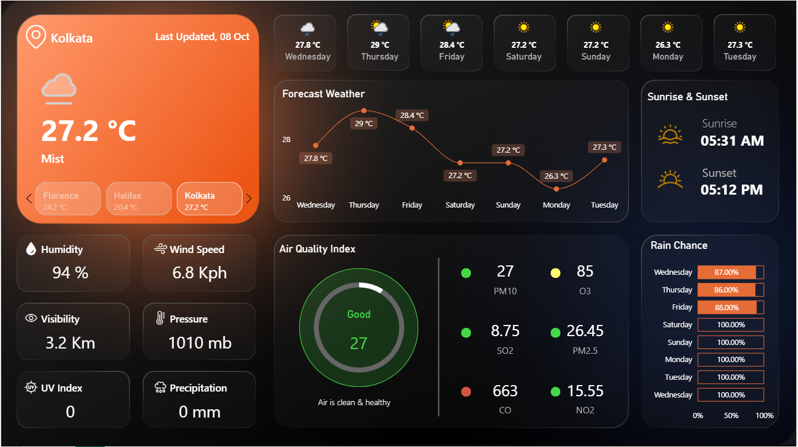
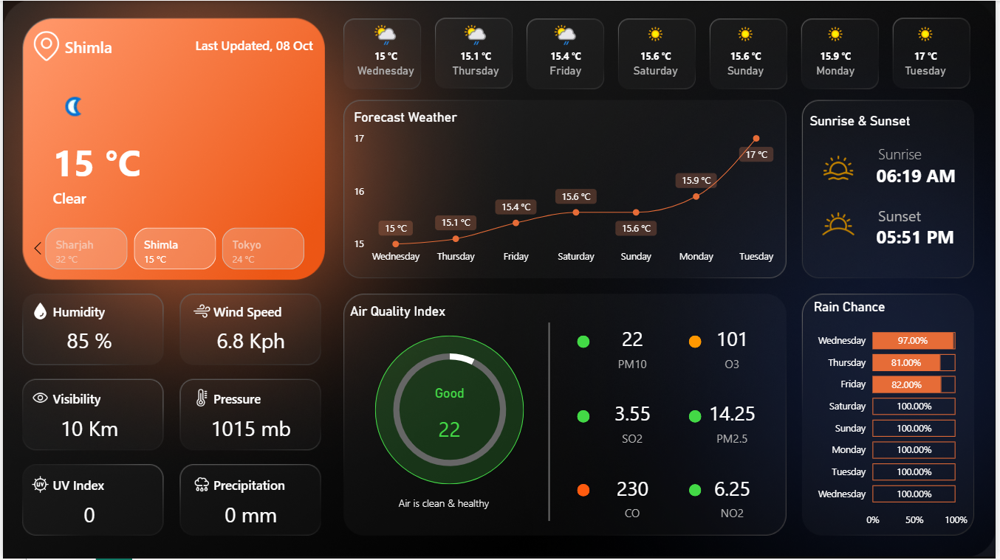
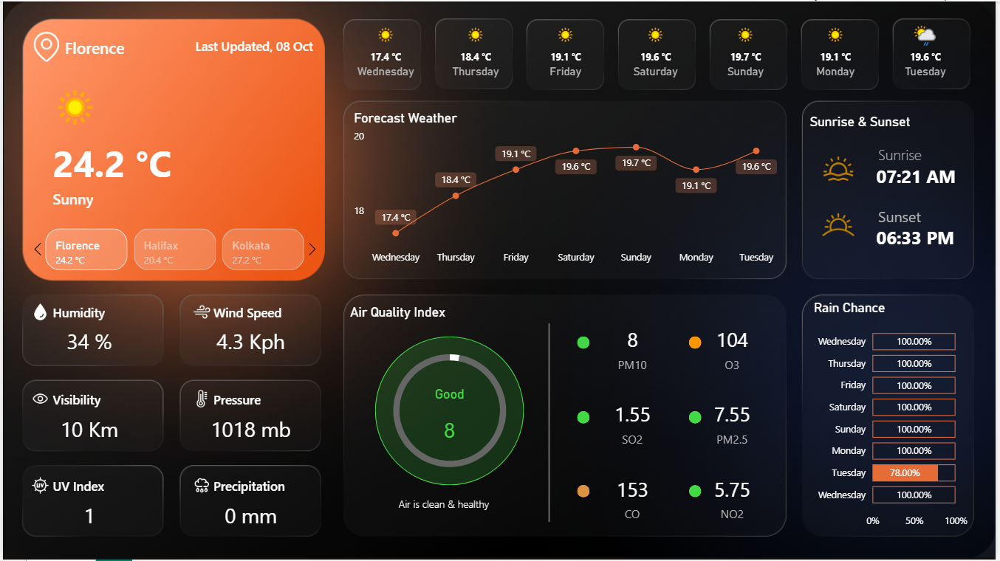

# Weather-Forecast-Dashboard

This project presents an interactive **Power BI dashboard** visualizing real-time and forecasted weather insights.  
It combines temperature, humidity, air quality, pressure, and other atmospheric indicators into a sleek and intuitive interface, providing a complete snapshot of current and future weather conditions.

---

## 📊 Dashboard Overview

The **Weather Report Dashboard** delivers a holistic view of environmental conditions across multiple cities and time periods. It helps track and compare weather trends with clear and modern visual elements.

* **Current Weather Summary** — Displays temperature, condition (e.g., mist, cloudy, clear), humidity, wind speed, and visibility for selected cities.  
* **Forecast Weather Trend** — Visual line chart showing upcoming daily temperatures over a 7-day period.  
* **Air Quality Index (AQI)** — Comprehensive breakdown of air quality parameters including PM10, PM2.5, O3, CO, SO2, and NO2 with real-time health indicators.  
* **Sunrise & Sunset Timings** — Highlights daily sunrise and sunset for easy reference.  
* **Rain Probability Chart** — Visual bar indicators showing the daily rain chance percentage for the next 7 days.  
* **Additional Climate Metrics** — Includes pressure, UV index, and precipitation values for deeper insight into atmospheric conditions.

---

## 🚀 Key Features

* **Dynamic & Interactive Dashboard** — Enables users to switch between multiple cities and instantly view their weather data.
* **Clean & Modern Design** — Uses dark gradient themes and bold typography for excellent contrast and readability.
* **Data Visualization Variety** — Combines KPI cards, line charts, gauges, bar charts, and numeric indicators.
* **Air Quality Integration** — Real-time AQI and pollutant readings categorized by health impact.
* **Forecast Integration** — Predictive trends for upcoming temperatures and rain chances.
* **User-Centric Experience** — All elements arranged for fast information access without clutter.

---

## 📈 Dashboard Components

### 1. **Current Conditions**
- Shows real-time weather details for selected city (temperature, condition, humidity, wind, and pressure).
- Includes **next/previous navigation** for switching between cities.
- **Insight:** Instant overview of environmental comfort levels and visibility range.

---

### 2. **Forecast Weather**
- Displays temperature predictions for the upcoming week.
- **Visuals:** Interactive line chart with data labels for daily highs and lows.
- **Insight:** Enables pattern detection for rising or dropping temperatures.

---

### 3. **Air Quality Index**
- Provides AQI score and pollutant breakdowns:
  - PM10, PM2.5, O3, CO, NO2, SO2
- **Visuals:** Circular gauge showing overall air health condition.
- **Insight:** Quick evaluation of air cleanliness and pollution severity.

---

### 4. **Sunrise & Sunset**
- Displays precise times for sunrise and sunset.
- **Visuals:** Minimalistic icon-based indicators for day–night cycle tracking.

---

### 5. **Rain Chance**
- Shows daily rain probability as horizontal bar percentages.
- **Insight:** Identifies high-rainfall days to support weather planning and analysis.

---

### 6. **Additional Parameters**
- Includes:
  - **Humidity**
  - **Pressure**
  - **Visibility**
  - **UV Index**
  - **Precipitation**
- **Insight:** Supports complete meteorological understanding beyond basic temperature tracking.

---

## 📷 Few Snapshots:

**Kolkata**


**Shimla**


**Florence**


---

## 📂 File Structure

```
.
├── Weather-Forecast-Report.pbix               (Power BI report file)
├── README.md                                  (Project documentation)
└── Previews/                                  (Dashboard screenshot images)
    ├── FlorenceForecast.PNG
    ├── KolkataForecast.PNG
    ├── ShimlaForecast.PNG

```

---

## ⚙️ Technologies Used

* Microsoft Power BI Desktop

---

## 📊 Data Source

* **Source:** WeatherAPI
* **Link:** [https://www.weatherapi.com](https://www.weatherapi.com)

---

## 🚀 How to Use This Project

1. Clone or download the repository:

   ```bash
   git clone https://github.com/teesta57/Weather-Forecast.git
   ```
2. Open the `Weather-Forecast-Report.pbix` file in Power BI Desktop.
3. Explore the dashboard and interact with the data.

---

## 🤝 Contributing

You're welcome to fork the project, explore the dataset, enhance visualizations, or suggest improvements.

---
